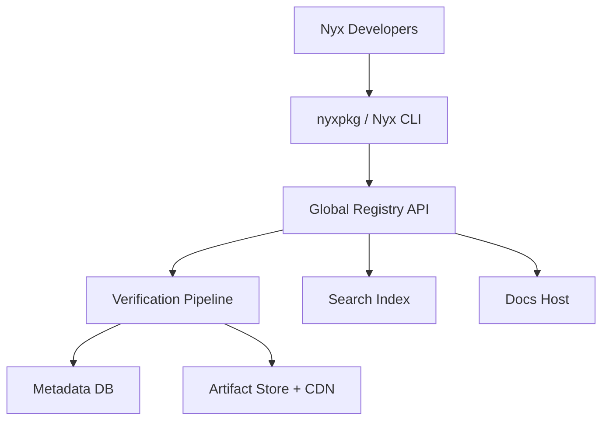
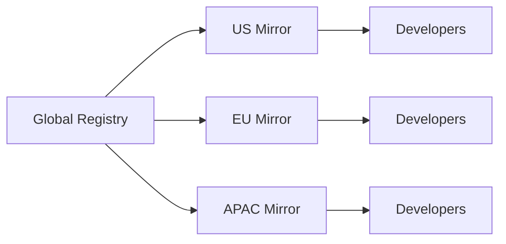
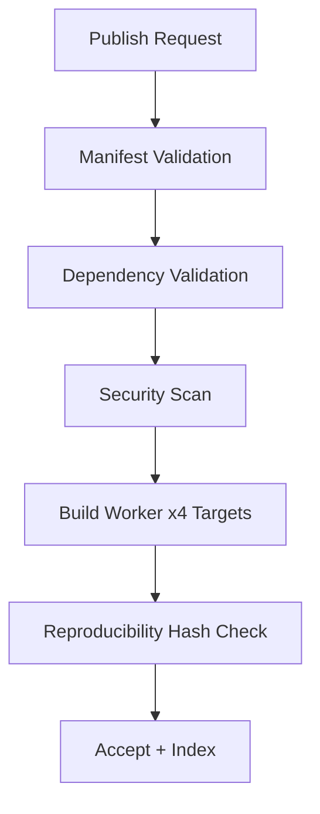

# Infrastructure Diagrams

## Control Plane

```mermaid
flowchart TD
  A[Nyx Developers] --> B[nyxpkg / Nyx CLI]
  B --> C[Global Registry API]
  C --> D[Verification Pipeline]
  D --> E[Metadata DB]
  D --> F[Artifact Store + CDN]
  C --> G[Search Index]
  C --> H[Docs Host]
```

## Data Plane

```mermaid
flowchart LR
  R[Global Registry] --> M1[US Mirror]
  R --> M2[EU Mirror]
  R --> M3[APAC Mirror]
  M1 --> U1[Developers]
  M2 --> U2[Developers]
  M3 --> U3[Developers]
```

## Verification Pipeline

```mermaid
flowchart TD
  P[Publish Request] --> V1[Manifest Validation]
  V1 --> V2[Dependency Validation]
  V2 --> V3[Security Scan]
  V3 --> V4[Build Worker x4 Targets]
  V4 --> V5[Reproducibility Hash Check]
  V5 --> A[Accept + Index]
```
